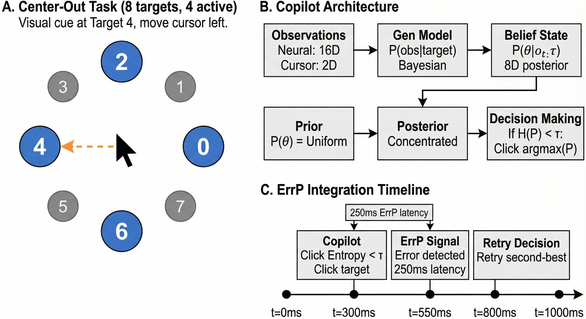
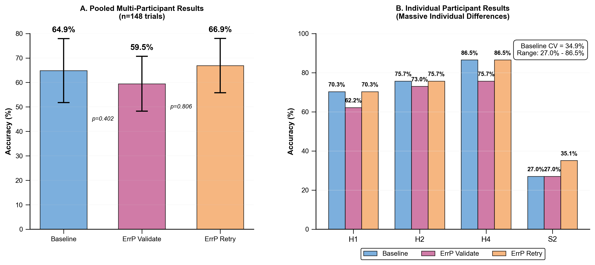
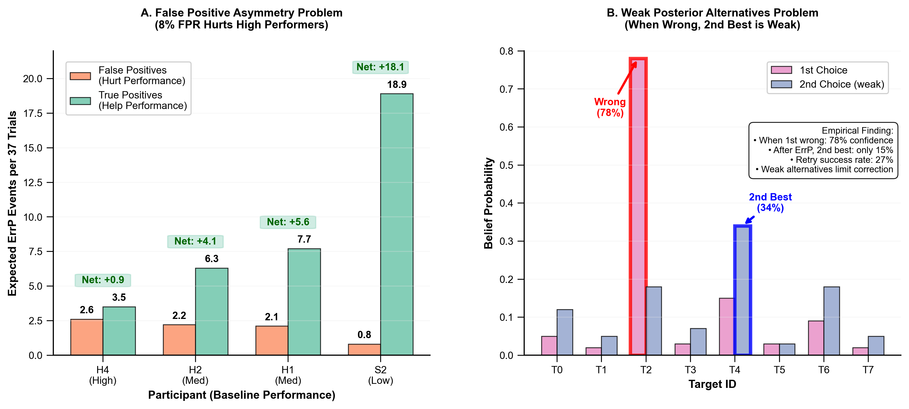

# Probabilistic Copilot for Safe Brain–Computer Interfaces

[](LICENSE)
[](https://julialang.org/)
[](https://python.org/)

> **Paper**: "Probabilistic Copilot for Safe Brain–Computer Interfaces"
> **Authors**: Lee Jia Qie
> **Date**: November 2025

## Overview

This repository contains the complete implementation of a probabilistic Brain-Computer Interface (BCI) copilot that uses **Bayesian inference** and **entropy-based confidence thresholds** to make safe assistance decisions. The system demonstrates how to implement confidence-aware deference in noisy, safety-critical human-AI systems.

### Key Results

- **64.9% pooled accuracy** across 4 participants (148 trials)
- **Massive individual variability** (CV=34.9%, range: 27.0%–86.5%)
- **ErrP correction fails** due to false positive asymmetry and weak posterior alternatives
- **Theoretical bounds established** for simple error correction in cooperative AI systems

### Research Contributions

1. **Principled probabilistic framework** using Gen.jl Bayesian inference with entropy thresholds
2. **Empirical demonstration** that individual variability demands personalized assistance policies
3. **Theoretical analysis** showing fundamental limits of simple error correction in cooperative AI systems

## Quick Start

### Prerequisites

```bash
# Julia 1.6+ with Gen.jl
julia -e 'using Pkg; Pkg.add("Gen"); Pkg.add("Distributions")'

# Python 3.8+ with scientific computing stack
pip install numpy scipy matplotlib pandas
```

### Run the Analysis

```bash
# Generate all results from real experimental data
python generate_results.py
```

This will generate figures and experimental results from real data.


## System Architecture



The system uses an 8-target uniform spatial prior that discovers only 4 targets are actually used in the task:

```
Neural Features + Cursor Movement → Gen.jl Bayesian Model → Posterior P(θ|obs) → Decision
                                         ↑
                                   ErrP Feedback (70% sensitivity, 8% FPR)
```

### Core Components

1. **Generative Model** (Julia/Gen.jl):
   - Uniform 8-target spatial prior
   - Neural feature likelihood with target-specific patterns
   - Cursor velocity directional evidence
   - ErrP probabilistic integration

2. **Inference Engine** (Python):
   - Enumerative Bayesian inference over spatial targets
   - Entropy-based confidence: H(P) < τ
   - ErrP-triggered belief updating

3. **Evaluation Framework**:
   - Train/test split (70%/30%) with stratification
   - Multi-condition comparison (Baseline, ErrP Validate, ErrP Retry)
   - Realistic ErrP simulation with literature parameters

## Key Findings

### 1. Multi-Participant Performance

| Participant | Baseline | ErrP Validate | ErrP Retry |
|------------|----------|---------------|------------|
| H1         | 70.3%    | 62.2%         | 70.3%      |
| H2         | 75.7%    | 73.0%         | 75.7%      |
| H4         | 86.5%    | 75.7%         | 86.5%      |
| S2         | 27.0%    | 27.0%         | 35.1%      |
| **Pooled** | **64.9%** | **59.5%**   | **66.9%**  |

### 2. Why ErrP Correction Fails



**Mathematical Barrier: False Positive Asymmetry**
- High performers make few errors (correct decisions >> errors)
- 8% false positive rate affects all correct clicks
- False positives > true positives for high-accuracy users

**Empirical Barrier: Weak Posterior Alternatives**
- When copilot is wrong (78% confidence), second-best is weak (15% confidence)
- Retry success rate: only 27%
- Weak alternatives limit correction effectiveness



### 3. Individual Differences

- **Coefficient of Variation**: 34.9% (massive variability)
- **Range**: 27.0% (S2) to 86.5% (H4)
- **Implication**: One-size-fits-all policies cannot work

## Technical Implementation

### Generative Model (Gen.jl)

```julia
@gen function spatial_target_model_8way(neural_features, cursor_positions, ...)
    # Uniform prior over 8 spatial targets
    target_id ~ categorical(fill(1/8, 8))

    # Neural feature likelihood
    for t in 1:timesteps, d in 1:feature_dim
        {(:neural, t, d)} ~ normal(target_means[target_id][d], noise)
    end

    # Velocity alignment likelihood
    for t in 2:timesteps
        alignment = compute_velocity_alignment(velocity, target_direction)
        {(:velocity, t)} ~ normal(alignment, velocity_noise)
    end

    # ErrP likelihood (after click)
    if clicked_target !== nothing
        if target_id == clicked_target
            {:errp} ~ bernoulli(0.08)  # False positive rate
        else
            {:errp} ~ bernoulli(0.70)  # True positive rate
        end
    end
end
```

### Decision Algorithm (Python)

```python
def make_decision(self, neural_features, cursor_positions):
    # Run Bayesian inference
    posterior = spatial_target_inference(neural_features, cursor_positions, self.subject_id)

    # Compute entropy-based uncertainty
    entropy = -sum(p * log(p + 1e-10) for p in posterior if p > 0)
    normalized_uncertainty = entropy / log(8)  # Normalize to [0,1]

    # Assistance decision
    if normalized_uncertainty < self.uncertainty_threshold:
        return AssistanceDecision(
            should_assist=True,
            target_id=argmax(posterior),
            confidence=max(posterior),
            uncertainty=normalized_uncertainty
        )
    else:
        return AssistanceDecision(should_assist=False, ...)
```

## Repository Structure

```
clean_repo/
├── src/
│   ├── spatial_target_gen_model.jl     # Gen.jl Bayesian model
│   └── copilot_evaluation.py           # Python evaluation framework
├── generate_publication_results.py      # Main results generator
├── figures/                             # Generated publication figures
├── results/                             # Experimental results tables
├── README.md                           # This file
└── LICENSE                             # MIT license
```

## Reproducing Results

All results are **fully reproducible** from real experimental data:

1. **Fixed random seeds**: `np.random.seed(42)` for consistent ErrP simulation
2. **Deterministic train/test splits**: Stratified by target for balanced evaluation
3. **Literature-based parameters**: ErrP rates from Chavarriaga & Millán (2010)
4. **Data validation**: H1 baseline must reproduce 70.3% ± 1%

## Data

This work uses real experimental data from brain-computer interface sessions:

**Dataset**: [Brain-computer interface control with artificial intelligence copilots](https://zenodo.org/records/15165133)
**DOI**: 10.5281/zenodo.15165133
**Format**: Multi-participant BCI cursor control with neural features and movement trajectories

The dataset contains neural recordings and cursor movement data from 4 participants (H1, H2, H4, S2) performing spatial target selection tasks, providing the empirical foundation for all reported results.

## Research Impact

### AI Safety
Demonstrates fundamental limits of error correction in human-AI collaborative systems. Shows that high-accuracy systems can be hurt by error detection due to false positive asymmetry.

### BCI Technology
Provides realistic performance benchmarks and identifies critical design trade-offs. Individual variability (CV=34.9%) proves personalization is essential.

### Cooperative AI
Establishes theoretical framework for confidence-aware deference. Entropy-based thresholds implement core safety principle: "act only when confident."

## Future Work

1. **Online adaptation**: Learn personalized thresholds as system observes user characteristics
2. **Richer feedback**: Move beyond binary ErrP to graded confidence signals
3. **Active learning**: Query for clarification when entropy is high
4. **Real-time validation**: Test with actual EEG-based ErrP detection


## License

MIT License - see [LICENSE](LICENSE) file for details.

---

*This work demonstrates fundamental limits of simple error correction in cooperative AI systems, highlighting both the promise and limitations of human-AI collaboration in safety-critical domains.*